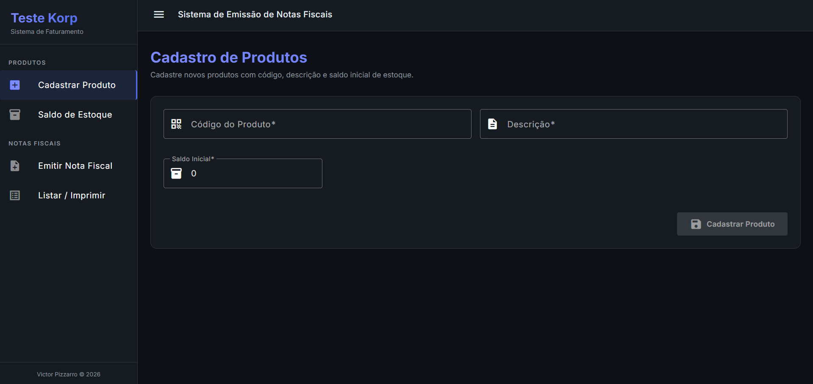
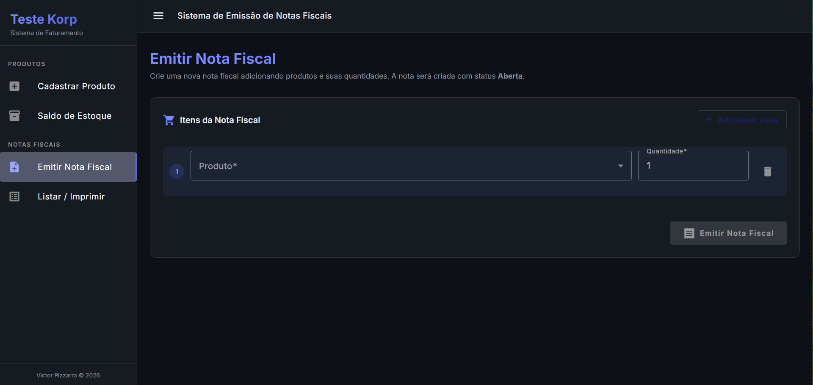
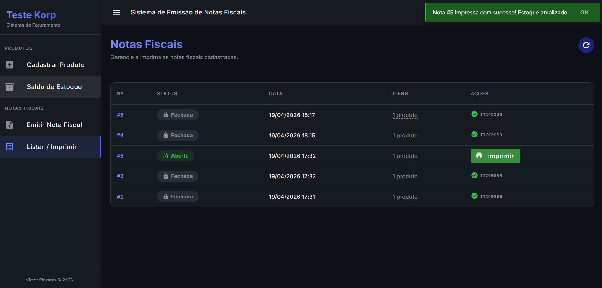
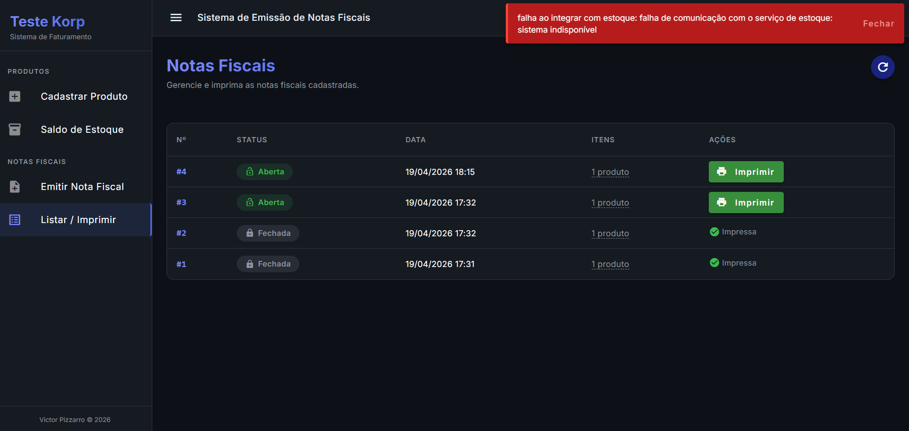

# Korp Test - Sistema de Emissão de Notas Fiscais


## 🏢 Descrição do Projeto

Este projeto é a solução desenvolvida para o desafio técnico da **Korp**. Trata-se de um sistema completo para cadastro de produtos e gestão do faturamento (emissão e impressão de Notas Fiscais).

A plataforma foi projetada utilizando uma arquitetura moderna distribuída em **Microsserviços no Backend (Golang)** e uma interface de usuário responsiva e reativa no **Frontend (Angular)**. O desenvolvimento focou não apenas em cumprir os requisitos obrigatórios, mas em proporcionar uma excelente experiência do usuário (UX), códigos manuteníveis, tratamento resiliente de falhas e implementação de diferenciais avançados como controle de concorrência e o uso de Inteligência Artificial.

---

## 📸 Telas e Experiência do Usuário (UI/UX)

A interface foi construída utilizando os princípios do **Angular Material**, entregando uma navegação limpa, feedback visual imediato e componentização eficiente.

> **Nota para Avaliadores**: Abaixo estão as representações visuais das funcionalidades implementadas.

| Tela de Cadastro de Produtos | Tela de Faturamento (Notas Fiscais) |
|:---:|:---:|
|  |  |
| *Controle de estoque, descrição e código.* | *Criação de notas com status inicial Aberta e múltiplos produtos.* |

| Fluxo de Impressão de Nota | Feedback de Falhas / Tratamento de Erro |
|:---:|:---:|
|  |  |
| *Geração da nota e desconto do saldo de forma síncrona.* | *Tratamento amigável caso o microsserviço de Estoque não responda.* |

---

## 🏗️ Arquitetura de Microsserviços e Tratamentos

A solução foi estruturada de forma distribuída para garantir independência técnica, atendendo rigorosamente à exigência do teste.

### 1. Serviços e Responsabilidades
- **`service-estoque`**: Responsável pela persistência em banco de dados real dos Produtos, atualização de saldos e controle central de disponibilidades.
- **`service-faturamento`**: Responsável pela orquestração das Notas Fiscais e agrupamento dos múltiplos itens.

### 2. Tratamento de Falhas e Resiliência
Conforme o cenário exigido, quando uma nota fiscal sofre a ação de **Impressão**, o Faturamento orquestra uma dedução via HTTP ao Estoque.
- Se o **microsserviço de Estoque falhar ou cair**, o sistema não sofre efeitos colaterais. O faturamento percebe a falha, preserva a integridade da nota (mantém *Aberta*) e imediatamente devolve o erro via backend propagando um feedback limpo, assertivo e seguro na tela do usuário.

### 3. Requisitos Opcionais Cumpridos com Êxito (Diferenciais)
- 🔒 **Tratamento de Concorrência Sênior (Pessimistic Locking)**: Resolvi o clássico problema de *Race Condition*. Se um produto tem saldo `1` e duas requisições de faturamento tentam utilizá-lo exatamente ao mesmo tempo, a transação garante a integridade por meio de um Lock Pessimista a nível de linha transacional no banco de dados. Uma fila é retida aguardando a outra, garantindo que a segunda nota falhe de forma controlada ao atestar a falta de saldo.
- 🤖 **Uso de Inteligência Artificial (Google Gemini)**: Fui além da validação técnica e integrei o fluxo de emissão à API do Google Gemini. O microsserviço utiliza a IA como um "auditor" que intercepta o payload e detecta anomalias em tempo real (ex: quantidades discrepantes em itens) antes mesmo de tocar nas travas do banco, combinando microsserviços tradicionais com análise inteligente.

---

## ⚙️ Detalhamento Técnico Solicitado

Respondendo diretamente ao formulário técnico da documentação do teste:

### Frontend (Angular)
- **Ciclos de Vida Utilizados**: Utilizado massivamente o `ngOnInit` para cargas iniciais de compontentes de listagem e também hooks nativos de ciclo de vida para destruir conexões caso aplicável (garbage collection).
- **Uso do RxJS**: A reatividade é inteiramente guiada por RxJS no tráfego de dados. Foram aplicados `Observables` via `HttpClient`, manipulação das pipes com `tap` (para loaders/atualização de estado), `catchError` para resgate e exibição de falhas de microsserviços, e blocos `finalize`.
- **Bibliotecas Visuais**: Toda a componentização (Tabelas dinâmicas, Modais de erro, Inputs de formulário, e Selects) foi elaborada com o framework UI **Angular Material**, oferecendo layout responsivo (100% de width em flex-containers).

### Backend (Golang)
- **Gerenciamento de Dependências**: Configurado utilizando as práticas e padrões absolutos de mercado da Google. Usamos `go.mod` dentro de cada pastinha de serviço, e um arquivo root `go.work` unificando a edição no contexto da máquina (Workspaces).
- **Frameworks e Bibliotecas**: O backend optou por se manter de altíssima performance utilizando bibliotecas canônicas do ecossistema para rotas e banco. Nenhuma dependência pesada desnecessária foi instalada, focando no paradigma cloud-native.
- **Tratamento de Erros no Backend**: Resiliência via propagação. O serviço de Estoque manipula erros nativos `err != nil` do banco, e devolve em estrutura JSON para as Rotas Restful com os respectivos Status Code (como `422 Unprocessable Entity` quando há quebra de regra de estoque). O serviço de Faturamento decodifica os bad requests e propaga a mensagem sem poluir logs na interface.

### Padrões de Arquitetura e Engenharia de Software (Backend)
Para garantir uma base de código imune à deterioração (*Technical Debt*) e compatível com ambientes escaláveis, implementei rígidas disciplinas corporativas no código fonte em Golang:
- **Domain-Driven Design (DDD)**: O ecossistema é ditado pelo domínio do negócio. A modelagem garante que as regras isoladas do que compõe um Produto ou Nota Fiscal existam puras no coração do projeto, não dependendo de frameworks externos ou do meio de transporte HTTP.
- **Clean Architecture (Arquitetura Limpa)**: O fluxo de dependência aponta sempre para dentro. Padrão estrito anti-acoplamento onde os controladores HTTP (*Handlers*) não encostam em dados; a comunicação para o repositório cruza fronteiras seguras abstraídas por Interfaces puras do Go (Injeção de dependência). 
- **Object Calisthenics & Clean Code**: Foco implacável em legibilidade e redução da complexidade cognitiva. Foram aplicadas técnicas como *Early Returns* (eliminando blocos aninhados de if/else e seta anti-pattern), nomenclatura autodescritiva em variáveis, e métodos extremamente granulares aderentes ao SRP (Single Responsibility Principle).

---

## 🧪 Base de Qualidade e Testes

A arquitetura orientada a serviços e separação de interfaces/repositórios permite injeção de Mock de maneira natural em Golang. Ao adotar esse isolamento (separando o service-estoque das rotas), o sistema é predisposto a testes paralelos com a biblioteca nativa asserções `testing` do Go, rodando validações sem necessidade de subir os servidores `go test ./...`.

---

## 🚀 Começando (Clone e Execução)

O sistema exige a instância real do banco de dados configurado localmente. 

### Serviços Golang (Backend)
No VSCode, navegue para a raiz e execute via terminal separados:
```shell
# Iniciando o Banco de dados relacional e MS Estoque
cd service-estoque
go run main.go

# Iniciando o MS de Faturamento
cd service-faturamento
go run main.go
```

### Aplicativo Angular (Frontend)
Em um terceiro terminal, entre na pasta do front para levantar a UI corporativa:
```shell
cd frontend
npm install  # (Caso seja a primeira inicialização)
npx ng serve
```
*Acesse `http://localhost:4200` via navegador.*

---

## 📹 Apresentação e Entrega

Acompanhe os resultados práticos da arquitetura e das interfaces na minha Nuvem/Vídeo submetido.

- 📺 **Vídeo de Apresentação:** [[Link do Google Drive / OneDrive aqui](https://drive.google.com/file/d/1NKJQB1CCGAjGNQydAyyVQXNZjDJ0WrPa/view?usp=sharing)]
- 📦 **Repositório do Código:** [Link público deste Github aqui](https://github.com/victorpizzarro/Korp_Teste_VictorPizzarro)

---
*Desafio Técnico Desenvolvido por Victor Pizzarro.*
